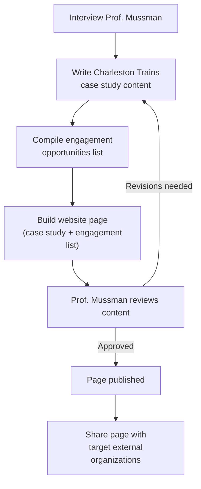
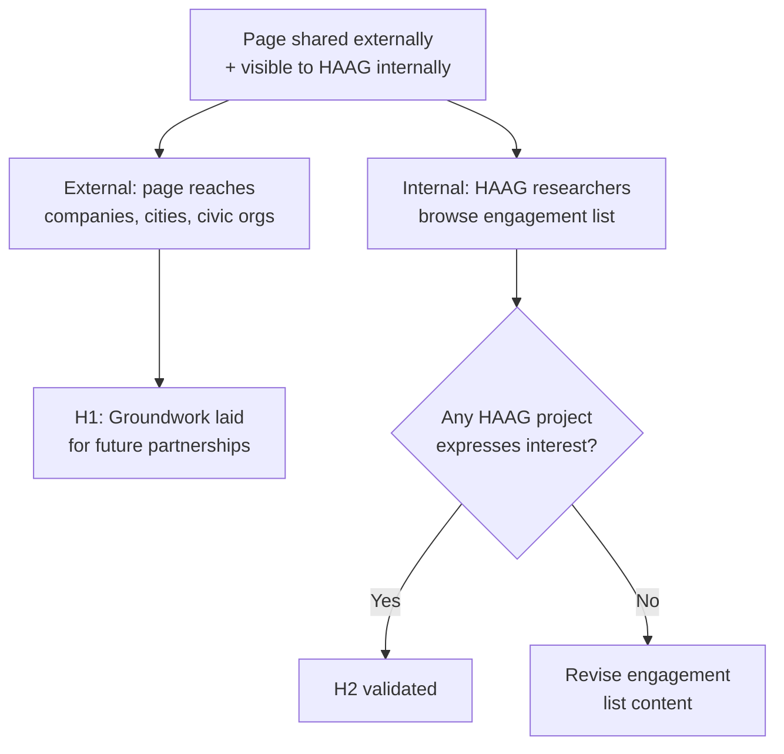

# Management & Leadership Mid-Semester Report

**Title:** HAAG-Wide External Engagement Initiative

---

# Initiative Questions

## Describe your initiative / Procedure.

The deliverable of this initiative is a single HAAG website page designed to grow the organization's real-world impact by connecting its research to external partners. Many HAAG projects have the potential to engage with companies, cities, and civic organizations — but that potential goes unrealized when the work isn't visible or framed accessibly to outside audiences. This initiative addresses that gap by creating a page that both demonstrates HAAG's capacity for impactful research and actively invites engagement. The Charleston Trains project, which is already working with the City of Charleston on a civic infrastructure problem, serves as the anchor case study — showing what a mature external partnership looks like and establishing HAAG's credibility as a research collaborator.

The page serves two audiences:

1. **External:** Feature the Charleston Trains project — which investigates whether train crossing blockages in Charleston, SC can be predicted to reduce traffic and improve emergency response times — as a case study in real-world civic engagement. By showcasing a successful partnership with the City of Charleston, the page signals to companies, municipalities, and other external organizations that HAAG is a credible research partner, with the goal of attracting future collaborations.

2. **Internal:** Provide a curated list of potential engagement opportunities for other HAAG projects, making it easy for researchers to identify and pursue their own external partnerships.

By combining these two functions on one page, the initiative uses Charleston Trains as a proof point while giving the rest of HAAG a concrete starting point for their own engagement efforts.

---

## Explain the hypotheses / KPIs you have measured at this time and what is left to be measured.

**Hypotheses:**
- **H1:** A website page featuring Charleston Trains as a case study will make HAAG's research visible to external stakeholders and lay the groundwork for future partnership inquiries.
- **H2:** A curated list of engagement opportunities on the same page will prompt interest from at least one other HAAG project.

**KPIs measured so far:**
- Interview with Prof. Mussman (faculty advisor, Charleston Trains) scheduled
- Charleston Trains case study content drafted

**KPIs still to be measured:**
- Website page published
- Page shared with at least one relevant external organization
- At least one HAAG project expresses interest in a listed engagement opportunity

---

## Explain your method for testing these hypotheses via flowcharts.

Two flowcharts describe the build and validation of the website page.

**Building the page**

**Validating the page**

---

## Explain how stakeholders are engaging with your initiative. Reflect on whether their engagement matches your expectations and what changes may be necessary given the behavior that you observed.

The primary stakeholders are the researchers in the Charleston Trains group who have expressed excitement about this external collaboration — engagement has exceeded initial expectations in terms of openness and enthusiasm.

Engagement with other HAAG project admins has been slower to initiate, which suggests a need for a different outreach plan. After seeing another manager post in the group Slack channel, and get positive feedback from other managers, I will apply the same approach.

---

## What processes have you documented or begun documenting to ensure the sustainability of your initiative? What additional documentation do you plan to complete? Link documents here for review.

An interview guide for Prof. Mussman has been drafted. A draft outline for the website page content has also been started. Both will be uploaded to the Github repo for this initiative.

**Remaining documentation planned:**
- Finalized case study write-up (post-interview)
- Engagement opportunities list
- Published website page

All documents will be linked in the GitHub repo for review as they are completed.

---

## How are you currently measuring progress toward your goals? What indicators of success or challenges have you identified so far?

Progress is tracked against three milestones:

1. Case study content drafted and reviewed by Prof. Mussman
2. Engagement list compiled
3. Page published

Success is straightforward: at least one external stakeholder — a company, city, or civic organization — expresses interest in partnering with a HAAG project as a result of the page, and at least one HAAG project engages with the engagement list. The main challenge so far is ensuring the list is specific and actionable enough to prompt real interest, rather than being too generic to be useful.

---

## What obstacles or bottlenecks have you encountered in implementing your initiative? Which anticipated challenges have materialized, and what unexpected issues have arisen?

The primary challenge encountered was scope: the original proposal was too narrowly focused on Charleston Trains, as noted in Bree's feedback. This has been addressed by reframing the initiative to be genuinely HAAG-wide, with Charleston Trains repositioned as a case study and engagement example rather than the sole subject.

Another obstacle is related to scope, and external engangement. How extensive should the list of possible collaborations be? And will external (and for that matter, internal,) stakeholders take the time to review and engage with this initiative? This remains an open question. 

An unexpected issue is ensuring the engagement list feels relevant and accessible to projects at different stages — what constitutes a useful external engagement opportunity varies considerably across HAAG research areas.
