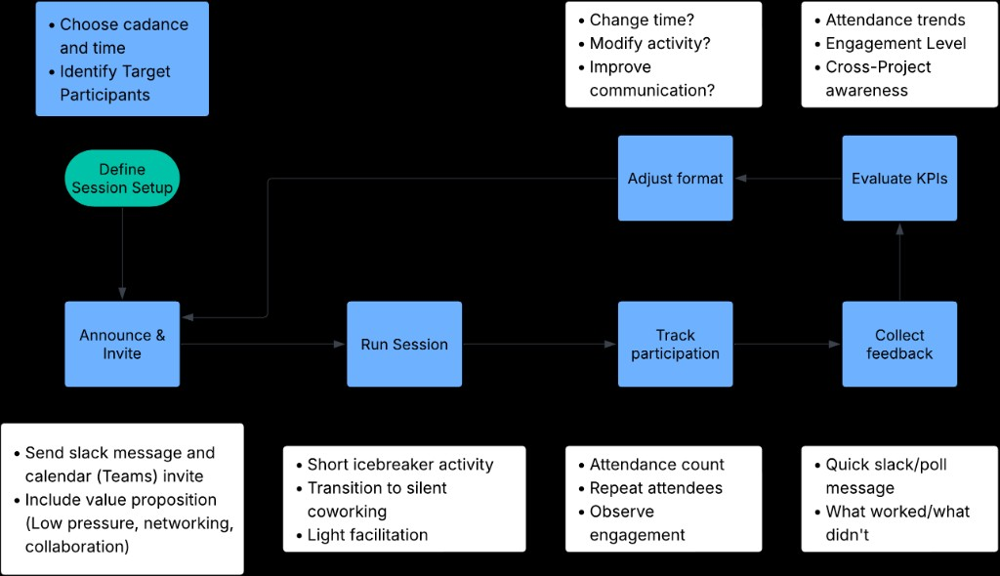

# HAAG Weekly Collaboration + Coworking Session

**Topic Area:** Communication  
**Format:** Student-led, weekly Microsoft Teams session (60 minutes)

---

## Why This Initiative

Right now, most HAAG teams mainly interact within their own project groups. Slack helps with updates, but it does not always lead to real cross-project conversations. It can be easy to stay in your own lane and not know what others are working on.

This initiative creates a simple, recurring space for people to connect, share ideas, and work alongside each other. The goal is to make collaboration feel natural rather than forced.

---

## Goal

- Increase awareness of what other teams are working on
- Encourage informal collaboration
- Create a low-pressure space to work together
- Strengthen community across HAAG

---

## Weekly Structure (60 Minutes)

| Time | Activity |
|------|----------|
| **0–5 min** | **Welcome** — Quick hello, overview of the plan for the session |
| **5–30 min** | **Group Activity** — A student facilitator runs a short activity (e.g., quick project lightning rounds, themed discussion about challenges, small breakout groups, or a simple collaboration game or prompt). Purpose: help people learn what others are doing and find common ground. |
| **30–55 min** | **Silent Coworking** — Cameras optional, microphones muted. Everyone works independently on HAAG-related tasks. Dedicated time to make progress while still feeling connected to others. |
| **55–60 min** | **Quick Wrap-Up** — Anyone who wants can briefly share what they worked on and one goal for next week. No formal reporting required. |

---

## How It Will Be Run

- A recurring Microsoft Teams invite will be created at the start of the semester.
- The session will happen at the same time each week.
- Facilitation will rotate among volunteers.
- A short Slack reminder will be posted before each session.
- Participation is optional.

---

## How We Will Measure Success

- Average attendance
- Repeat participation
- Informal feedback from participants
- Whether new cross-project collaborations emerge

After a few weeks, we can adjust the format based on feedback.

---

## Who This Is For

- HAAG student researchers
- Project teams
- Admin and faculty who want to join

---

## Summary

This initiative is meant to be simple and sustainable. It combines light structure with flexibility, giving HAAG members a regular opportunity to connect and work alongside one another. Over time, this can help reduce silos and make collaboration more natural across projects.

# Mid-Semester Report

## Describe your initiative / Procedure

My initiative is a weekly, student-led collaboration and coworking session designed to create more interaction across HAAG teams.

Right now, most communication happens within individual project groups. While Slack helps with updates, it does not always lead to real conversations or collaboration across teams. This initiative introduces a recurring, low-pressure space where researchers can connect, share what they are working on, and work alongside each other.

Each session is designed to include a short structured activity followed by silent coworking time. The goal is to make collaboration feel natural and consistent rather than something that has to be forced.

At this point in the semester, the initiative has been designed and structured but has not yet been fully implemented.

---

## Explain the hypotheses / KPIs you have measured at this time and what is left to be measured

The main hypothesis is that creating a consistent, low-effort space for interaction will increase cross-project awareness and collaboration.

Planned KPIs:
- Attendance per session  
- Repeat participation  
- Engagement during activities  
- Informal feedback from participants  

What has been measured so far:
- Initial interest and perceived value of the idea through informal conversations  

What still needs to be measured:
- Actual attendance and consistency  
- Level of engagement during sessions  
- Whether participants gain awareness of other teams  
- Whether collaboration emerges across projects  

---

## Explain your method for testing these hypotheses via flowcharts

The planned testing process follows a repeating cycle: define setup, announce and invite, run the session, track participation, collect feedback, evaluate KPIs, and adjust the format before the next round.

In outline:

1. Launch weekly session  
2. Track attendance and participation  
3. Observe engagement during activities  
4. Collect informal feedback  
5. Adjust format and structure based on feedback  

This will be an iterative process focused on improving participation and usefulness over time.

---

## Explain how stakeholders are engaging with your initiative

So far, engagement has mainly been at the idea level.

There has been interest in the concept, especially because it is low pressure and flexible. However, since sessions have not yet been run, there has not been measurable participation yet.

This aligns with expectations for an initiative at this stage. Moving forward, the key will be transitioning from interest to actual attendance and participation.

Potential adjustments:
- Clearer communication of value  
- Stronger reminders  
- Possibly adjusting timing based on availability  

---

## What processes have you documented or begun documenting to ensure sustainability?

I have documented:
- The purpose of the initiative  
- The weekly/bi-weekly structure  
- How sessions are intended to run (facilitation, reminders, format)  

This is currently stored in my project documentation on GitHub.

Planned documentation:
- A facilitation guide for rotating hosts  
- A simple checklist for running each session  
- Examples of effective activities  

The goal is to make the process easy to repeat and transferable to others.

---

## How are you currently measuring progress toward your goals?

At this stage, progress is being measured by:
- Completion of initiative design  
- Clarity of structure and implementation plan  
- Initial stakeholder interest  

Indicators of progress:
- Defined structure and schedule  
- Clear plan for execution  

Current challenge:
- Transitioning from planning to actual implementation  

---

## What obstacles or bottlenecks have you encountered?

Main challenges:
- Timing and scheduling across participants  
- Competing priorities and time constraints  
- Getting initial traction for attendance  

Expected challenges:
- Optional participation leading to lower initial turnout  
- Building consistency over time  

Unexpected challenges:
- None significant so far, as the initiative is still in the planning phase  

The main bottleneck currently is moving from planning into execution.